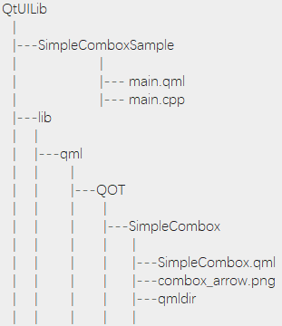

# 自定义QML模块

模块是由文件qmldir指定的, 每个模块都需要对应一个qmldir

## 自定义Combobox组件
以自定义一个简单的下拉列表框为例子, 演示如何自定一个QML模块

目录结构:



这里我们将`QtUILib/lib/qml` 作为了所有自定QML模块的根目录; 

在此根目录下, 我们还创建了子目录`QOT`作为一个命名组, 在该命名组下 才是我们自定的模块

### 定义组件UI

创建SimpleCombox.qml文件,并定义其内容

### qmldir

此处定义qmldir文件内容
```
module SimpleCombox
SimpleCombox 1.0 SimpleCombox.qml

```

`module <ModuleIdentifier> `

module关键字，后接模块标识符，每个qmldir文件只能有一个标识符。

`[singleton] <TypeName> <InitialVersion> <File>`

singleton用来声明一个单例类型，它是可省略的。TypeName是类型名称。InitialVersion用来指定版本号。File是QML类型对应文件所在的位置。

### 导入模块

#### QML_IMPORT_PATH

修改项目配置文件 SimpleComboxSample.pro 中的`QML_IMPORT_PATH`
```
# Additional import path used to resolve QML modules in Qt Creator's code model
QML_IMPORT_PATH = ../lib/qml
```
此处设置的作用是在Qt Creator里能够导入并识别模块,另外该路径是自定义模块的根路径.


#### 导入并使用

```qml
// main.qml
import QtQuick 2.12
import QtQuick.Window 2.12
import QOT.SimpleCombox 1.0

Window {
    visible: true
    width: 640
    height: 480
    title: qsTr("SimpleCombox sample")

    SimpleCombox{
        anchors.verticalCenter: parent.verticalCenter
        anchors.horizontalCenter: parent.horizontalCenter
        textRole:"display"
        comboxMode: ListModel{
            ListElement {
                name: "item-1"
                display:"Item 1"
            }
            ListElement {
                name: "item-2"
                display:"Item 2"
            }
            ListElement {
                name: "item-3"
                display:"Item 3"
            }
        }
    }
}

```
使用`SimpleCombox`之前需要导入: `import QOT.SimpleCombox 1.0` ;

由于我们将自定义模块放在了`QOT`子目录下, 所以导入的时候需加上`QOT`前缀, 这里类似Java中package

#### 运行
在运行前, 需要install自定义的模块, 即让Qt 执行时能够找到自定义模块;

目前有以下几种方式:
* 设置环境变量`QML2_IMPORT_PATH`为自定义QML模块的根路径 `../lib/qml`
* 直接通过代码设置环境变量 `qputenv("QML2_IMPORT_PATH", "../lib/qml");`
* 通过代码添加`import`搜索路径 
```
QQmlApplicationEngine engine;
engine.addImportPath("../lib/qml");
```

在本例中代码如下:
```c++
//main.cpp
#include <QGuiApplication>
#include <QQmlApplicationEngine>

int main(int argc, char *argv[])
{
    QCoreApplication::setAttribute(Qt::AA_EnableHighDpiScaling);
    QGuiApplication app(argc, argv);

    // solution 1:
    //    qputenv("QML2_IMPORT_PATH","../lib/qml");
    QQmlApplicationEngine engine;
    // solution 2:
    engine.addImportPath("../lib/qml");
    const QUrl url(QStringLiteral("qrc:/main.qml"));
    QObject::connect(&engine, &QQmlApplicationEngine::objectCreated,
                     &app, [url](QObject *obj, const QUrl &objUrl) {
        if (!obj && url == objUrl)
            QCoreApplication::exit(-1);
    }, Qt::QueuedConnection);
    engine.load(url);
    return app.exec();
}
```

## 参考链接
[QML——添加自定义模块](https://www.cnblogs.com/hellovenus/p/6357585.html)

[Github:DefineAndUseModule](https://github.com/kongziming/QtDemo/tree/master/DefineAndUseModule)
